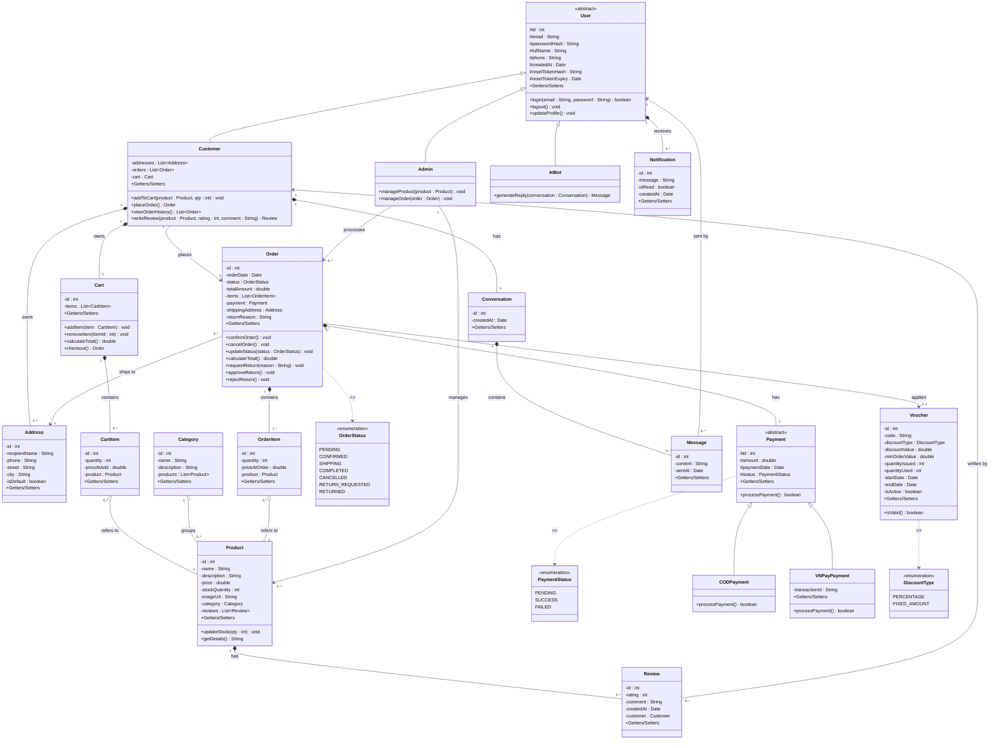

# Class Diagram hoàn chỉnh — Web Ecommerce (Core)

Quy ước visibility dùng trong toàn bộ file:
- `private` — chỉ nội bộ class dùng (mặc định cho hầu hết thuộc tính)
- `protected` — dùng ở 2 lớp cha thiết kế để kế thừa (`User`, `Payment`), cho phép class con truy cập trực tiếp field mà không cần getter
- `public` — tất cả method là API nên luôn public

Đây là bản đầy đủ có thể copy gần như nguyên trạng thành file `.java` (chỉ cần thêm phần thân method).

---

## 1. User (abstract)
```java
public abstract class User {
    protected int id;
    protected String email;
    protected String passwordHash;
    protected String fullName;
    protected String phone;
    protected Date createdAt;
    protected String resetTokenHash;   // băm SHA-256 của token quên mật khẩu (null nếu không có yêu cầu)
    protected Date resetTokenExpiry;   // hết hạn sau 30 phút

    public boolean login(String email, String password) { ... }
    public void logout() { ... }
    public void updateProfile() { ... }
}
```

## 2. Customer extends User
```java
public class Customer extends User {
    private List<Address> addresses = new ArrayList<>();
    private List<Order> orders = new ArrayList<>();
    private Cart cart;

    public void addToCart(Product product, int qty) { ... }
    public Order placeOrder() { ... }
    public List<Order> viewOrderHistory() { return orders; }
    public Review writeReview(Product product, int rating, String comment) { ... }
}
```
`writeReview()` phải validate ở tầng service: chỉ cho tạo Review nếu Customer có ít nhất 1 Order chứa Product này với status `COMPLETED` (hoặc `RETURNED`). Đây là business rule, không thể hiện trong class diagram — chỉ thể hiện qua method signature.

## 3. Admin extends User
```java
public class Admin extends User {
    public void manageProduct(Product product) { ... }
    public void manageOrder(Order order) { ... }
}
```

## 4. Address
```java
public class Address {
    private int id;
    private String recipientName;
    private String phone;
    private String street;
    private String city;
    private boolean isDefault;
}
```

## 5. Category
```java
public class Category {
    private int id;
    private String name;
    private String description;
    private List<Product> products = new ArrayList<>();
}
```

## 6. Product
```java
public class Product {
    private int id;
    private String name;
    private String description;
    private double price;
    private int stockQuantity;
    private String imageUrl;
    private Category category;
    private List<Review> reviews = new ArrayList<>();

    public void updateStock(int qty) { ... }
    public String getDetails() { ... }
}
```

## 7. Cart
```java
public class Cart {
    private int id;
    private List<CartItem> items = new ArrayList<>();

    public void addItem(CartItem item) { items.add(item); }
    public void removeItem(int itemId) { ... }
    public double calculateTotal() { ... }
    public Order checkout() { ... }
}
```

## 8. CartItem
```java
public class CartItem {
    private int id;
    private int quantity;
    private double priceAtAdd;
    private Product product; // aggregation — chỉ giữ reference
}
```

## 9. Order
```java
public class Order {
    private int id;
    private Date orderDate;
    private OrderStatus status;
    private double totalAmount;
    private List<OrderItem> items = new ArrayList<>();
    private Payment payment;
    private Address shippingAddress;
    private String returnReason; // null nếu không có yêu cầu hoàn hàng

    public void confirmOrder() { ... }
    public void cancelOrder() { ... } // Customer (chủ đơn) hoặc Admin đều gọi được — check quyền ở tầng service
    public void updateStatus(OrderStatus status) { ... }
    public double calculateTotal() { ... }
    public void requestReturn(String reason) { ... } // Customer gọi, chỉ hợp lệ khi status = COMPLETED
    public void approveReturn() { ... } // Admin gọi, chuyển RETURN_REQUESTED -> RETURNED, restock
    public void rejectReturn() { ... } // Admin gọi, chuyển RETURN_REQUESTED -> COMPLETED (giữ nguyên)
}
```

## 10. OrderItem
```java
public class OrderItem {
    private int id;
    private int quantity;
    private double priceAtOrder; // snapshot giá, không đổi dù Product đổi giá sau
    private Product product; // aggregation
}
```

## 11. OrderStatus (enum)
```java
public enum OrderStatus {
    PENDING,
    CONFIRMED,
    SHIPPING,
    COMPLETED,
    CANCELLED,
    RETURN_REQUESTED, // khách yêu cầu hoàn hàng sau khi COMPLETED
    RETURNED          // admin duyệt hoàn hàng xong
}
```
Transition hợp lệ: `PENDING → CONFIRMED → SHIPPING → COMPLETED`, nhánh `PENDING/CONFIRMED → CANCELLED`, và nhánh mới `COMPLETED → RETURN_REQUESTED → RETURNED` (hoặc quay lại `COMPLETED` nếu Admin từ chối). Validate transition thực hiện trong `updateStatus()`, không phải trong enum.

## 12. Payment (abstract)
```java
public abstract class Payment {
    protected int id;
    protected double amount;
    protected Date paymentDate;
    protected PaymentStatus status;

    public abstract boolean processPayment();
}
```

## 13. PaymentStatus (enum)
```java
public enum PaymentStatus {
    PENDING, SUCCESS, FAILED
}
```

## 14. CODPayment extends Payment
```java
public class CODPayment extends Payment {
    @Override
    public boolean processPayment() { ... }
}
```

## 15. VNPayPayment extends Payment
```java
public class VNPayPayment extends Payment {
    private String transactionId;

    @Override
    public boolean processPayment() { ... }
}
```

## 16. Review
```java
public class Review {
    private int id;
    private int rating; // 1-5 sao
    private String comment;
    private Date createdAt;
    private Customer customer; // tác giả
}
```

---

## Bảng tổng hợp quan hệ

| Quan hệ | Loại | Multiplicity | Label trên mũi tên |
|---|---|---|---|
| User → Customer, Admin | Inheritance | — | (không ghi) |
| Payment → CODPayment, VNPayPayment | Inheritance | — | (không ghi) |
| Customer — Address | Composition | 1 — 0..* | owns |
| Customer — Cart | Composition | 1 — 1 | owns |
| Cart — CartItem | Composition | 1 — 0..* | contains |
| Order — OrderItem | Composition | 1 — 1..* | contains |
| Order — Payment | Composition | 1 — 1 | has |
| Product — Review | Composition | 1 — 0..* | has |
| CartItem — Product | Aggregation | 0..* — 1 | refers to |
| OrderItem — Product | Aggregation | 0..* — 1 | refers to |
| Category — Product | Aggregation | 1 — 0..* | groups |
| Customer — Order | Association | 1 — 0..* | places |
| Admin — Product | Association | 1 — 0..* | manages |
| Admin — Order | Association | 1 — 0..* | processes |
| Order — Address (shippingAddress) | Association | 0..* — 1 | ships to |
| Review — Customer | Association | 0..* — 1 | written by |
| User — Notification | Composition | 1 — 0..* | receives |
| Customer — Conversation | Composition | 1 — 1 | has |
| Conversation — Message | Composition | 1 — 0..* | contains |
| Message — User | Association | 0..* — 1 | sent by |
| User — AIBot | Inheritance | — | (không ghi) |
| Order — Voucher | Association | 0..* — 0..1 | applies |
| Voucher → DiscountType | Dependency | — | `<<use>>` |
| Order → OrderStatus | Dependency | — | `<<use>>` |
| Payment → PaymentStatus | Dependency | — | `<<use>>` |

**Lưu ý về Dependency:** `OrderStatus`/`PaymentStatus` chỉ là kiểu dữ liệu (enum) mà `Order`/`Payment` dùng cho 1 thuộc tính — không phải quan hệ sở hữu/tham chiếu object như các loại kia, nên đúng chuẩn UML phải vẽ mũi tên đứt nét (Dependency, `..>`) kèm stereotype `<<use>>`, không phải Association.

## 17. Notification (mới)
```java
public class Notification {
    private int id;
    private String message;
    private boolean isRead;
    private Date createdAt;
}
```
Tạo tự động mỗi khi `Order.updateStatus()` được gọi — không cần class Order gọi trực tiếp constructor, có thể tách 1 service riêng `NotificationService` để lo việc này (không cần class diagram thể hiện service layer).

## 18. Conversation (mới)
```java
public class Conversation {
    private int id;
    private Date createdAt;
}
```

## 19. Message (mới)
```java
public class Message {
    private int id;
    private String content;
    private Date sentAt;
}
```
`sender` không lưu field riêng `isAdmin` hay tương tự — chỉ cần tham chiếu kiểu `User`, polymorphism tự lo việc phân biệt Customer hay Admin gửi.

---

## 20. AIBot (mới)
```java
public class AIBot extends User {
    public Message generateReply(Conversation conversation) { ... }
}
```
Không có field riêng — dùng lại field kế thừa từ `User` (có thể để placeholder cho email/password vì bot không thật sự đăng nhập). `Message.sender` giữ nguyên kiểu `User`, không cần sửa gì — `AIBot` tự động hợp lệ nhờ polymorphism. Logic gọi API AI thật (OpenAI/Anthropic...) nằm trong thân `generateReply()`, không thể hiện trong class diagram.

---

## 21. Voucher (mới)
```java
public class Voucher {
    private int id;
    private String code;
    private DiscountType discountType;
    private double discountValue;
    private double minOrderValue;
    private int quantityIssued;
    private int quantityUsed;
    private Date startDate;
    private Date endDate;
    private boolean isActive;

    public boolean isValid() { ... } // check startDate <= now <= endDate, isActive, quantityUsed < quantityIssued
}
```

## 22. DiscountType (mới, enum)
```java
public enum DiscountType {
    PERCENTAGE, FIXED_AMOUNT
}
```

---

---

## Phần Optional còn lại (chưa đưa vào diagram)

- `Wishlist` — quan hệ nhiều-nhiều `Customer` — `Product`, model như Aggregation qua bảng trung gian, label: `saves`

---

## Mermaid source (paste vào mermaid.live để export ảnh/svg cho báo cáo)


